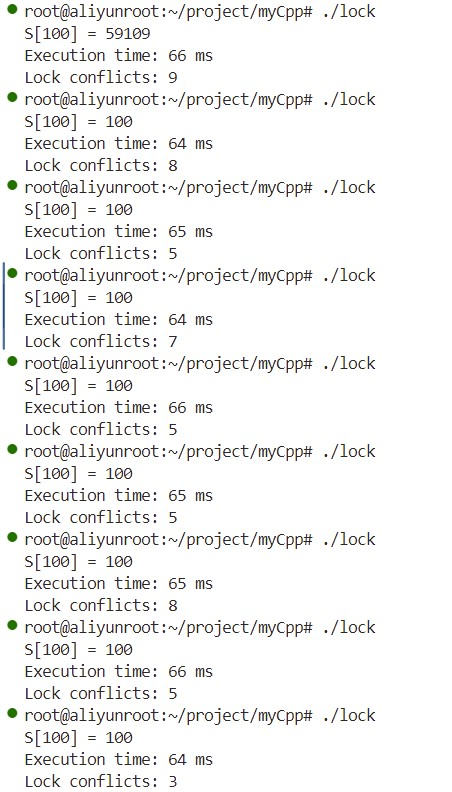

给定一个长度为 N（N = 100,000）的整数数组 S，有 M（M >= 2）个工作者并发访问和更新 S。每个工作者重复以下操作 10,000 次：生成随机数 i 和 j，0 <= i，j < 100,000。更新 S 使得 S(j) = S(i) + S(i+1) + S(i+2)。如果 i + 1 或 i + 2 越界，则使用 (i+1) % N 或 (i+2) % N。

提示：

（a）请考虑**并发保护**，即读取 S(i)、S(i+1)、S(i+2) 和更新 S(j) 是原子操作。参考**两阶段锁算法** 
（b） 注意锁的粒度。每个工作者每次只读取 3 个元素并写入 1 个元素。总共有 100,000 个元素。并发工作者访问同一个元素的概率很低，使用细粒度的锁可以减少冲突，提高并发性。
（c）注意**读锁和写锁**的区别。
（d）**j可能落在[i,i+2]**范围内。
（e）补充思考：会不会出现死锁？如何避免？


根据提示基本实现了基础功能并且避免了死锁的风险。

采用全局排序并且去重的策略保证多线程并发时不会发生死锁，同时在锁争用时能保持并发；对于每个元素的读取和写入采取细粒度的锁，能够有效减少冲突；unique_lock能够确保按顺序自动获取锁和释放锁，shared_mutex支持共享锁和独占锁。

该代码考虑了死锁可能出现的情况：

1.为了避免两个线程以不同的顺序获得锁发生死锁的情况，这里采用全局锁策略，对其进行排序，确保所有线程以相同的顺序获得多个锁，同时排序能够解决j在任何范围内的情况。

2.如果`j`和`i,i+1,i+2`其中的任何一个数相同，会出现同一个线程多次获得相同的锁，程序会提前检测到该问题同时抛出异常，因此使用unique去重即可。

3.如果获取锁`try_lock()`时发生锁争用，直接`lock()`阻塞等待锁的释放，同时记录争用次数，用`shared_mutex`可以只避免写锁的争用，读锁可以同时读取资源。

```cpp
// 代码链接：
#include <iostream>
#include <vector>
#include <random>
#include <thread>
#include <mutex>
#include <shared_mutex>
#include <chrono>
#include <atomic>
#include <cassert>
#include <algorithm>

const int N = 100000;
std::vector<int> S(N);              // 整数数组
std::shared_mutex locks[N];
std::atomic<int> lock_conflicts{0}; // 记录锁争用次数

int getRandomIndex()
{
  static thread_local std::mt19937 rng(std::random_device{}());
  std::uniform_int_distribution<> dist(0, N - 1);
  return dist(rng);
}

void updateArray(int i, int j)
{
  int i1 = (i + 1) % N;
  int i2 = (i + 2) % N;

  if (i == j || i == i1 || i == i2)
    return;

  // 多个线程对锁的获取顺序不同容易导致死锁
  // 所以这里采用全局锁顺序的策略，但是经测试仍然可能出现死锁的情况
  std::vector<int> indices = {i, i1, i2, j};
  std::sort(indices.begin(), indices.end());
  auto last = std::unique(indices.begin(), indices.end());
  indices.erase(last, indices.end());

  // unique_lock能够确保按顺序自动获取锁和释放锁
  // shared_mutex支持共享锁和独占锁
  std::vector<std::unique_lock<std::shared_mutex>> locks_list;
  
  for (int idx : indices)
  {
    bool conflict = !locks[idx].try_lock(); // 尝试获取锁
    if (conflict)
    {
      lock_conflicts++;  // 记录锁争用
      locks[idx].lock(); // 阻塞等待锁
    }
    locks_list.emplace_back(std::unique_lock<std::shared_mutex>(locks[idx], std::adopt_lock));
  }

  S[j] = S[i] + S[i1] + S[i2];
}

void worker(int id, int num_operations)
{
  for (int op = 0; op < num_operations; ++op)
  {
    int i = getRandomIndex();
    int j = getRandomIndex();
    updateArray(i, j);
  }
}

int main()
{
  for (int i = 0; i < N; ++i)
  {
    S[i] = i;
  }

  int num_workers = 4;        // 工作者数量
  int num_operations = 10000; // 每个工作者的操作次数

  auto start_time = std::chrono::high_resolution_clock::now();

  std::vector<std::thread> workers;
  for (int i = 0; i < num_workers; ++i)
  {
    workers.emplace_back(std::thread(worker, i, num_operations));
  }

  for (auto &w : workers)
  {
    w.join();
  }

  auto end_time = std::chrono::high_resolution_clock::now();

  std::cout << "S[100] = " << S[100] << std::endl;
  std::cout << "Execution time: "
            << std::chrono::duration_cast<std::chrono::milliseconds>(end_time - start_time).count()
            << " ms" << std::endl;
  std::cout << "Lock conflicts: " << lock_conflicts.load() << std::endl;

  return 0;
}
```

运行结果：




